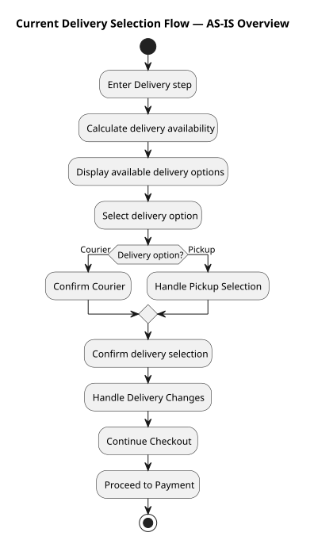
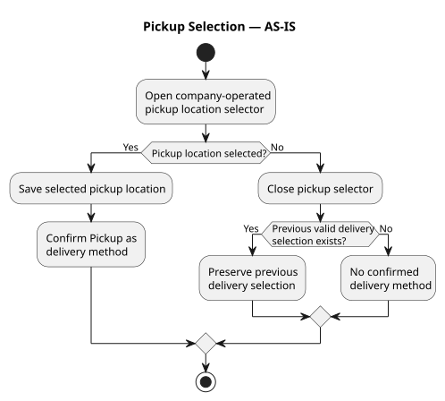
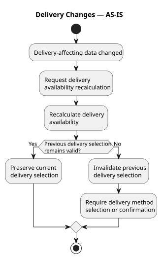

# Current Delivery Selection Flow — AS-IS

## Назначение

Этот артефакт описывает текущее AS-IS поведение Web Checkout при выборе способа получения заказа на шаге Delivery.

Модель используется для понимания:

- текущего customer interaction flow;
- расчёта delivery availability;
- выбора Courier или Pickup;
- выбора company-operated pickup location;
- состояния delivery selection;
- обработки изменений, влияющих на delivery availability;
- условий перехода с Delivery на Payment.

Будущий partner pickup flow в данную AS-IS модель не входит.

## Scope

### In Scope

Модель охватывает:

- вход Customer на Delivery step;
- calculation доступных delivery options;
- отображение доступных delivery methods;
- выбор Courier;
- выбор Pickup;
- выбор company-operated pickup location;
- закрытие pickup selector без выбора новой location;
- сохранение предыдущего valid delivery selection;
- изменение данных, влияющих на delivery availability;
- availability recalculation;
- проверку валидности предыдущего delivery selection;
- invalidation предыдущего selection;
- необходимость повторного выбора или подтверждения delivery method;
- переход с Delivery на Payment.

### Out of Scope

Модель не охватывает:

- Customer Details до входа на Delivery;
- Payment flow после перехода на Payment step;
- order fulfillment;
- partner pickup;
- partner integration;
- TO-BE behavior.

## Preconditions

- Customer находится в Web Checkout.
- Checkout располагает данными, необходимыми для выполнения delivery availability calculation.
- Customer переходит на Delivery step.

## Participants

### Customer

Взаимодействует с Delivery step, выбирает способ получения заказа и, при использовании Pickup, конкретную pickup location.

### Web Checkout

Управляет пользовательским Delivery flow, отображает доступные delivery options, сохраняет delivery selection и инициирует availability calculation или recalculation.

### Delivery Availability Capability

Определяет доступность delivery methods для текущих данных заказа и доставки.

## AS-IS Flow

Текущий Delivery Selection flow представлен иерархически.

Overview показывает основной end-to-end flow на шаге Delivery. Более сложное поведение Pickup Selection и Delivery Changes декомпозировано в отдельные detail diagrams.

Это позволяет сохранить читаемость Overview без потери существенной AS-IS логики.

### Delivery Selection Overview

Overview показывает основной flow:

1. Customer переходит на Delivery step.
2. Выполняется calculation доступных delivery options.
3. Web Checkout отображает доступные delivery options.
4. Customer выбирает delivery option.
5. Для Courier выполняется подтверждение Courier selection.
6. Для Pickup выполняется отдельный Pickup Selection flow.
7. Delivery selection подтверждается.
8. При наличии изменений, влияющих на delivery, выполняется Delivery Changes flow.
9. Customer продолжает Checkout.
10. Web Checkout переводит Customer на Payment step.

Детальная логика `Handle Pickup Selection` и `Handle Delivery Changes` раскрывается отдельными diagram models.

## Detailed Behavior

### Pickup Selection — AS-IS

Этот flow раскрывает activity `Handle Pickup Selection` из Overview.

#### Main Path

1. Web Checkout открывает selector company-operated pickup locations.
2. Customer выбирает конкретную pickup location.
3. Web Checkout сохраняет выбранную pickup location.
4. Pickup подтверждается как delivery method.
5. Управление возвращается в основной Delivery Selection flow.

#### Selector Closed Without New Selection

Если Customer закрывает pickup selector без выбора новой location:

1. Web Checkout проверяет наличие предыдущего valid delivery selection.
2. Если предыдущий valid selection существует:
   - предыдущий delivery selection сохраняется;
   - Customer возвращается в основной Delivery flow с сохранённым selection.
3. Если предыдущий valid selection отсутствует:
   - confirmed delivery method отсутствует;
   - Customer остаётся в Delivery context и должен выполнить дальнейший выбор или подтверждение delivery method.

Закрытие pickup selector без выбора location само по себе не означает Checkout drop-off.

### Delivery Changes — AS-IS

Этот flow раскрывает activity `Handle Delivery Changes` из Overview.

Delivery-affecting change может потребовать повторного calculation доступных delivery methods.

#### Previous Selection Remains Valid

1. Происходит изменение данных, влияющих на delivery availability.
2. Web Checkout запрашивает availability recalculation.
3. Delivery Availability Capability выполняет recalculation.
4. Web Checkout проверяет валидность предыдущего delivery selection.
5. Если selection остаётся valid:
   - текущий delivery selection сохраняется;
   - Customer может продолжить Delivery flow.

#### Previous Selection Becomes Invalid

Если после recalculation предыдущий delivery selection больше невалиден:

1. Web Checkout invalidates предыдущий delivery selection.
2. Customer должен повторно выбрать или подтвердить доступный delivery method.
3. Переход к следующему шагу Checkout требует valid delivery selection.

## Main Flow

1. Customer переходит на Delivery step в Web Checkout.
2. Web Checkout инициирует delivery availability calculation для текущего заказа и данных доставки.
3. Delivery Availability Capability определяет доступные delivery methods.
4. Web Checkout отображает доступные delivery options.
5. Customer выбирает Courier или Pickup.
6. Если выбран Courier, Web Checkout подтверждает Courier selection.
7. Если выбран Pickup, выполняется `Pickup Selection — AS-IS`.
8. Web Checkout сохраняет valid delivery selection.
9. Если возникают delivery-affecting changes, выполняется `Delivery Changes — AS-IS`.
10. Customer продолжает Checkout при наличии valid delivery selection.
11. Web Checkout переводит Customer на Payment step.

## Alternative Flows

### AF-01 — Pickup Location Selection

**Trigger:** Customer выбирает Pickup.

1. Web Checkout открывает selector company-operated pickup locations.
2. Customer выбирает конкретную pickup location.
3. Web Checkout сохраняет location.
4. Pickup становится confirmed delivery method.
5. Customer возвращается в основной Delivery flow.

### AF-02 — Pickup Selector Closed Without Selection

**Trigger:** Customer открывает Pickup selector, но закрывает его без выбора новой location.

1. Web Checkout проверяет предыдущий valid delivery selection.
2. Если он существует, предыдущий selection сохраняется.
3. Если он отсутствует, Customer остаётся без confirmed delivery method.
4. Customer возвращается в Delivery context.

### AF-03 — Delivery Availability Recalculation

**Trigger:** Изменяются данные, влияющие на delivery availability, например address или состав cart.

1. Web Checkout инициирует availability recalculation.
2. Delivery Availability Capability выполняет recalculation.
3. Web Checkout проверяет предыдущий delivery selection.
4. Если selection остаётся valid, он сохраняется.
5. Если selection становится invalid:
   - предыдущий selection invalidates;
   - требуется повторный выбор или подтверждение delivery method.

### AF-04 — No Progression to Payment

**Trigger:** Customer не переходит с Delivery на Payment в рамках текущей Checkout session.

Для session-level funnel analysis такая session классифицируется как Delivery → Payment drop-off.

Текущий dataset позволяет определить факт отсутствия progression на Payment, но не позволяет установить единственную причину такого поведения.

## Decision Points

### D1 — Availability Calculation

**Decision:** Availability calculation успешен?

**Outcomes:** Yes / No

Текущее поведение при technical failure или timeout ещё требует уточнения.

### D2 — Available Delivery Options

**Decision:** Какие delivery methods доступны Customer?

**Known observed options:** Courier / Courier + Pickup.

Availability может зависеть от текущих данных заказа и доставки.

### D3 — Delivery Option

**Decision:** Какой доступный delivery option выбирает Customer?

**Outcomes:** Courier / Pickup.

### D4 — Pickup Location Selection

**Decision:** Выбрана конкретная pickup location?

**Outcomes:** Yes / No.

### D5 — Previous Delivery Selection

**Decision:** Существует ли предыдущий valid delivery selection при выходе из Pickup selector без нового выбора?

**Outcomes:** Yes / No.

### D6 — Selection Validity After Recalculation

**Decision:** Остаётся ли предыдущий delivery selection valid после availability recalculation?

**Outcomes:** Yes / No.

### D7 — Checkout Progression

**Decision:** Может ли Customer продолжить Checkout с текущим delivery selection?

Для перехода к следующему шагу требуется valid delivery selection.

## Exit Conditions

### Proceed to Payment

Customer имеет valid delivery selection и продолжает Checkout.

Web Checkout переводит Customer на Payment step.

### Remain on Delivery

Customer остаётся на Delivery step, если дальнейшее взаимодействие с delivery selection ещё требуется.

Это состояние само по себе не является Checkout failure или session drop-off.

### Session-Level Drop-off

Customer не переходит с Delivery на Payment в рамках анализируемой Checkout session.

Текущий dataset позволяет определить такой outcome, но не устанавливает его причину.

## Known Limitations / Open Questions

1. Текущее session-level Product Analytics evidence показывает association между delivery availability и Delivery → Payment drop-off, но не устанавливает causal relationship.

2. Наличие только Courier связано с более высоким observed Delivery → Payment drop-off, однако текущий observational dataset не доказывает, что ограниченный выбор delivery options является причиной этого поведения.

3. Отсутствие значения `selected_delivery_method` не может использоваться как однозначный признак того, что Customer не нашёл подходящий delivery option.

4. Существующая instrumentation не позволяет надёжно определить сценарий «Customer просмотрел delivery options, но ни один из них ему не подошёл».

5. AS-IS behavior при technical failure или timeout availability calculation в рамках текущего Discovery ещё не подтверждено.

6. Текущая модель описывает customer interaction на Web Checkout Delivery step и не описывает downstream fulfillment behavior.

7. Partner pickup, partner integration и будущий TO-BE behavior намеренно исключены из данной AS-IS модели.

## Model Decomposition

AS-IS модель разделена на три визуальных представления.

### Overview

- Canonical model: `current-delivery-selection-as-is.puml`
- Visualization: `current-delivery-selection-as-is.svg`

Показывает основной Delivery Selection flow и точки декомпозиции.

### Pickup Selection Detail

- Canonical model: `pickup-selection-as-is.puml`
- Visualization: `pickup-selection-as-is.svg`

Раскрывает выбор company-operated pickup location и поведение при выходе из selector без нового выбора.

### Delivery Changes Detail

- Canonical model: `delivery-changes-as-is.puml`
- Visualization: `delivery-changes-as-is.svg`

Раскрывает availability recalculation и обработку валидности существующего delivery selection.

## Representation Consistency

`README.md` содержит подробное текстовое представление AS-IS модели.

PlantUML-файлы являются каноническими diagram models соответствующего уровня декомпозиции.

SVG-файлы генерируются из соответствующих PlantUML-моделей и являются их визуальным представлением.

Overview намеренно содержит меньше деталей, чем textual specification и detail diagrams. Различие в уровне детализации не должно изменять или противоречить AS-IS semantics.